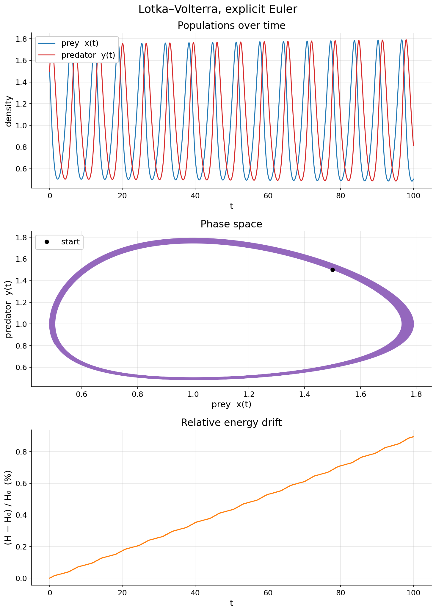

# Lotka-Volterra Predator-Prey Simulation

A C++20 implementation of the Lotka-Volterra predator-prey model using explicit Euler integration. This is a learning project focused on practicing modern C++ and numerical simulation.



## Overview

The Lotka-Volterra equations describe the dynamics of biological systems where two species interact: one as predator, one as prey. This project simulates those equations numerically and outputs the results for visualization.

The model uses the following system of ODEs:

```
dx/dt = A·x·(1 - y)
dy/dt = D·y·(x - 1)
```

where `x` and `y` are normalized (relative) population densities.

## Project Structure

```
.
├── CMakeLists.txt              # Build configuration
├── main.cpp                    # Executable entry point
├── volterra.hpp                # Class and struct declarations
├── volterra.cpp                # Implementation
├── volterra.test.cpp           # Unit tests (doctest)
├── tests_calculator_python.py  # Python script to generate reference values
├── plot_results.py             # Visualization script
├── input.txt                   # Simulation parameters
├── results.txt                 # Output (generated, not included here)
└── results.png                 # Plot (generated)
```

## Requirements

- CMake ≥ 3.28
- A C++20-compatible compiler (GCC or Clang)
- Python 3 with `numpy`, `scipy`, and `matplotlib` (for tests and plotting)

## Building

```bash
mkdir build
cd build
cmake ..
cmake --build .
```

The build enables:
- Warnings (`-Wall -Wextra -Wpedantic` and more)
- AddressSanitizer + UBSan in Debug mode
- Standard library assertions

To disable tests:
```bash
cmake .. -DBUILD_TESTING=OFF
```

## Running

The program reads parameters from `input.txt`:

```
A B C D N delta_t x0 y0
```

Example:
```
1.0 1.0 1.0 1.0 100000 0.001 1.5 1.5
```

Then run:
```bash
./volterra
```

Output is written to `results.txt` with columns: `t`, `x(t)`, `y(t)`, `H(x,y)`.

## Testing

```bash
cd build
ctest --output-on-failure
```

or run directly:
```bash
./volterra.test
```

Test reference values were generated using `tests_calculator_python.py`, which uses `scipy.integrate.solve_ivp` as an independent solver.

## Visualization

After running the simulation:

```bash
python plot_results.py
```

This produces `results.png` with three panels:
1. Population over time
2. Phase space trajectory
3. Relative energy drift

## Notes

- The simulation works with *relative* coordinates internally (`xrel = C·x/D`, `yrel = B·y/A`) to improve numerical stability.
- The conserved quantity `H(x,y) = -D·ln(x) + C·x + B·y - A·ln(y)` is tracked to monitor integration error.
- Input validation throws exceptions for non-positive parameters or invalid starting points.

## Declaration of AI use
As the purpose of this project was to practice C++ coding from scratch, AI use was strictly limited to debugging (identifying problems & suggesting fixes).
